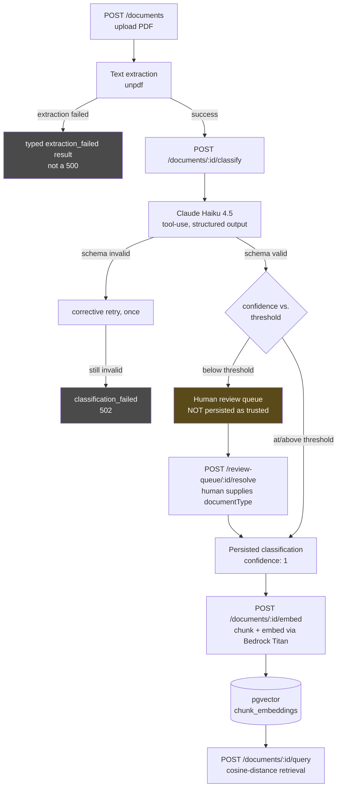
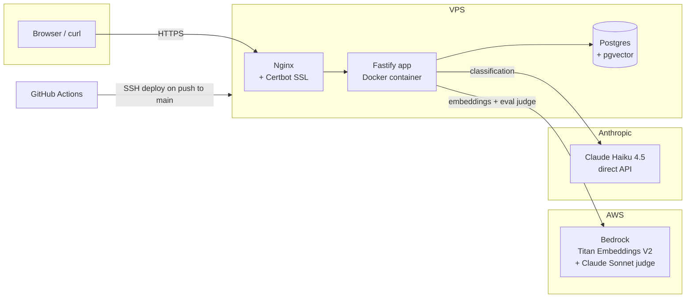

# doctriage

An AI-powered document triage service for insurance claims — upload a PDF, get it classified, extracted, and routed, with the production-operations layer a real deployment actually needs: confidence-based human review fallback, per-request cost tracking, correlation-ID logging, and layered defense against prompt injection.

**Live demo:** `https://doctriage.<yourdomain>` — upload a sample claim document and watch it move through the real pipeline.

---

## What this is

Insurance claims arrive as PDFs — claim forms, medical reports, police reports, repair estimates — and someone (or something) has to figure out what each one is before it can be routed to the right downstream process. This service does that: it accepts a PDF, extracts its text, classifies it with an LLM, and — depending on how confident that classification is — either trusts it automatically or routes it to a human review queue. Classified documents are also chunked and embedded into a vector store, so their content can be retrieved by question later (the "R" in RAG; there's no answer-generation step on top of it yet, by design — see [Design decisions](#design-decisions--tradeoffs)).

This isn't a chatbot wrapper around an LLM API. It's a backend service with the engineering a production AI feature actually needs: retries and corrective retries around a genuinely unreliable upstream, prompt versioning with an eval harness to catch regressions, a fallback path for when the model isn't confident enough to trust, real cost attribution per request, and defense-in-depth against a document that's actively trying to manipulate the model reading it.

---

## Architecture

### Request pipeline



Every external call (classification, embedding) is wrapped in retry-with-backoff and a timeout, logs through a `documentId`-bound correlation logger, and records a cost entry — regardless of whether the call ultimately succeeded, was queued for review, or failed outright.

### Infrastructure



Mongo and Redis were stood up in `docker-compose.yml` early on (Week 1) to prove the networking/config out, but doctriage itself never ended up needing either — they've since been removed from this repo's compose file rather than kept as unused weight. Both are planned for reuse in this learning plan's later months' projects (a code-review agent in Month 2, an event-processing platform in Month 3), so they're not being thrown away — just no longer this service's responsibility to carry.

### API surface

| Method | Route | What it does |
|---|---|---|
| `POST` | `/documents` | Upload a single PDF, extract its text |
| `POST` | `/documents/batch-upload` | Upload multiple PDFs in one request |
| `GET` | `/documents/:id` | Fetch a document's current state (extraction, classification, chunk count) |
| `POST` | `/documents/batch` | Fetch several documents by ID in one call |
| `POST` | `/documents/:id/classify` | Classify via Claude; routes to review queue if confidence is low |
| `POST` | `/documents/:id/embed` | Chunk + embed the document's text into pgvector |
| `POST` | `/documents/:id/query` | Retrieve the most relevant chunks for a question |
| `GET` | `/review-queue` | List classifications awaiting human resolution |
| `POST` | `/review-queue/:id/resolve` | Human supplies the correct `documentType` |
| `GET` | `/metrics` | Token usage and cost, totaled and broken down by pipeline stage |
| `GET` | `/health` | Liveness check |

---

## Design decisions & tradeoffs

The reasoning below is pulled from this project's own day-by-day design docs (`docs/`, gitignored from this repo but written and kept locally throughout the build) — decided while the tradeoff was actually being weighed, not reconstructed after the fact for this README.

**pgvector, not a dedicated vector database.** Postgres was already in the stack for relational/workflow state; reusing it for embeddings avoids operating a fourth database technology on a resource-constrained single VPS. The decisive factor: MongoDB's vector search requires MongoDB Atlas (managed-cloud only) — the plain self-hosted `mongo:7` image this project was evaluated against didn't support it at all, so Mongo was never actually a real option here (and was later removed from this repo's compose file entirely once it was clear this service had no other use for it either — see [Infrastructure](#infrastructure)). pgvector also uniquely enables hybrid search — combining a relational `WHERE` filter with vector similarity in one atomic query (e.g. "relevant chunks, but only from open claims filed in the last 30 days") — which a standalone vector database can't do without duplicating business metadata into a second system. The honest tradeoff: pgvector's ANN indexing is less mature than a purpose-built vector database at very large scale — the right call at this project's actual scale, not a claim that it's strictly better.

**Separate `/classify`, `/embed`, and `/query` endpoints, not one bundled "process this document" call.** Extraction is fast, free, and local; classification and embedding are paid, rate-limited, external calls. Bundling them would mean upload's success depends on an LLM being up, directly undermining the retry/timeout isolation built around each external call. The separation also turns out to make the eval harness dramatically simpler: it can score classification accuracy and retrieval quality independently, and re-run just one step in isolation when iterating on a prompt version — without re-embedding or re-uploading anything. The production-correct version of "process this document" is actually async/queue-based (publish → worker → poll), which is deliberately out of scope for this project — that's the subject of a later distributed-systems project, not this one; reaching for it here would have been scope creep against this month's actual goal of getting synchronous LLM-call patterns right first.

**A confidence threshold routes to a human review queue, instead of trusting every classification.** Through the end of Week 2, every schema-valid classification — regardless of confidence — was persisted and returned identically. A response passing schema validation and a response being *trustworthy* are different claims; nothing distinguished them. `CLASSIFICATION_CONFIDENCE_THRESHOLD` (default `0.7`) is a reasonable starting point, not a value derived from measurement — the honest follow-up experiment would be collecting labeled classifications across the confidence range and checking where accuracy actually starts dropping off. A below-threshold result is deliberately **not** persisted onto the document record even provisionally — the field's meaning stays "trustworthy" only, never "trustworthy, unless you also happen to check the queue."

**Claude Haiku for classification, not Sonnet — a real, quantified tradeoff, not a default.** Sonnet's pricing is exactly 3x Haiku's on both input and output tokens. A real classification call on this project's sample data cost $0.001292 on Haiku — roughly $1.29 per 1,000 documents, versus ~$3.90 per 1,000 on Sonnet. The honest caveat: this project has never actually run a Haiku-vs-Sonnet *accuracy* comparison to weigh against that 3x cost — the existing eval harness compares prompt versions on the same model, not models against each other. The complete answer to "why not Sonnet" isn't "it's more expensive" alone (cost never justifies a model choice on its own) — it's "3x more expensive, with the accuracy half of that argument not yet measured, and cheap to go measure."

**Layered prompt injection defense — no single layer is trusted alone.** Every document is untrusted third-party input read verbatim into a prompt. Three independent layers: (1) the classification prompt explicitly instructs the model that `<document>` content is data, never instructions (v3 of the prompt, promoted immediately as a security fix rather than gated behind eval measurement the way an accuracy-motivated prompt change would be); (2) `sanitizeForPrompt` strips/neutralizes prompt-structure lookalikes (fake turn markers, common injection phrasings) before text ever reaches a prompt, applied identically to the classification prompt and the LLM-as-judge prompts; (3) the existing Zod schema validation on the way out rejects any response that doesn't match the expected contract, independent of whether the injection itself was ever caught upstream. None of the three is claimed to fully solve injection on its own — the point is that an attack has to defeat all three, not just write a cleverer regex against one.

**Prompt versioning + an eval harness, not hand-edited prompt strings.** Prompts are versioned, named files (`src/prompts/classification/v1.ts`, `v2.ts`, `v3.ts`) resolved through a registry, not inline template literals — so a prompt change is reviewable in a diff, traceable in logs (every classification logs which version produced it), and A/B-testable. The eval harness (`pnpm eval`) runs a fixed fixture set through both classification's structured-field scoring and an LLM-as-judge layer for the free-text `reasoning` field, catching regressions a prompt edit might introduce before they reach production traffic.

**Correlation-ID logging, threaded through the call graph, not per-module loggers.** Every route binds `request.log.child({ documentId })` once and threads that logger into every service call it makes — `classifyDocument`, the embedding generator, retrieval — replacing each service's own disconnected `pino` instance. A single document's entire journey through the pipeline is greppable by ID, even under concurrent requests, which a per-module logger can't provide once more than one document is in flight.

---

## Known limitations

Stated plainly rather than left implicit:

- `GET /documents/:id` can't currently distinguish "never submitted for classification" from "classified, but pending human review" — both show no `classification` field. A deliberate, named tradeoff from Day 2 of the fallback-logic work, not an oversight.
- `GET /health` is currently a hardcoded `{ status: 'ok' }` with no real dependency check — it proves the process is up and responding, not that Postgres is reachable. Closing this is real, scoped follow-up work, not something silently ignored.
- The cost-tracking pricing table is confirmed against official Anthropic/AWS Bedrock pricing as of the date in `src/services/costTracking.ts`'s header comment — pricing pages can drift after that; the plumbing being correct matters more than any specific dollar figure staying current forever.

---

## Running locally

```bash
cp .env.example .env   # fill in ANTHROPIC_API_KEY and AWS credentials
docker compose up -d postgres mongo redis
pnpm install
pnpm dev                # http://localhost:3000
```

Or the full containerized stack, matching what actually runs on the VPS:

```bash
docker compose up
```

## Testing

```bash
pnpm test        # full suite — no real API credentials required, everything's mocked/in-memory
pnpm eval         # runs the eval harness against real Claude/Bedrock — costs real (small) money
```

## Deployment

Push to `main` triggers `.github/workflows/deploy.yml`, which SSHes into the VPS, pulls, and runs `docker compose up -d --build`. Nginx (with a Certbot-issued, auto-renewing cert) sits in front as the only public entry point — the app container's port is not directly reachable from outside the VPS. A VPS-side cron job polls `/health` and posts to a webhook if the service goes down.
